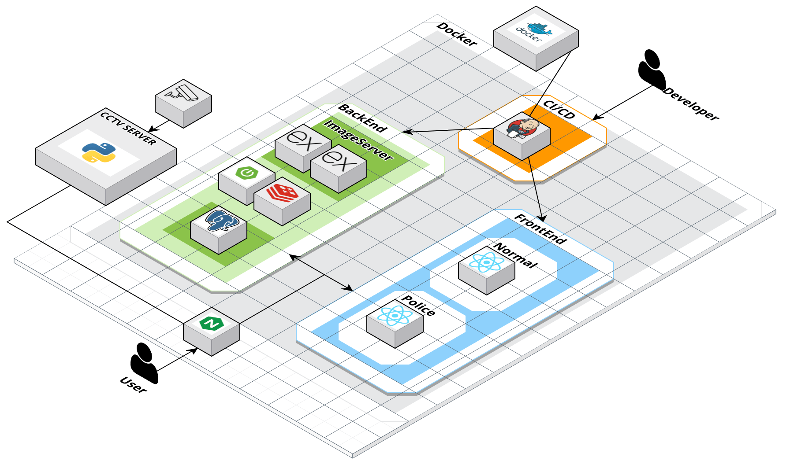

# KICKCAP 킥보드 단속 플랫폼

### ✍🏻 프로젝트 설명:

- 현재 사회에서는 개인형 이동장치(PM)와 관련된 안전사고가 많이 대두되고 있습니다. 이에 수동적으로 이루어지는 킥보드 단속환경을 개선하고자 카메라에 학습된 AI모델을 연결하여 자동 단속시스템을 개발하였습니다.

- 저희 프로젝트는 킥보드 번호판을 통해 자동 단속의 가능성과 벌점 제도를 바탕으로 킥보드 단속의 개선방향을 제시하여 보다 나은 이용 문화를 도모하고 있습니다.

### 개발기간 :
- 2024.08.26 ~ 2024.10.11(7주)

### 개발환경 : 
- 배포 환경 : EC2 ubuntu(20.04.6)
- GPU 서버 : Ubuntu(20.04), Python3.9

### 기술스택 :
- 백엔드 :        
- 프론트엔드 :      
- DevOps :    


### 아키텍쳐 : 


### 프로젝트 설치 및 실행방법 :
- Police Front
```
cd kickcap-police
npm install
npm start
```

- User Front
```
cd kickcap-user
npm install
npm start
```

- Backend docker-compose
```
services:
  api:
    image: parkbeong/kickcap:latest
    container_name: kickcap-8080
    environment:
      SPRING_DATASOURCE_URL: {postgreSQL}
      SPRING_DATASOURCE_USERNAME: {dbId}
      SPRING_DATASOURCE_PASSWORD: {dbId}
      SPRING_DATA_REDIS_HOST: {redis}
      SPRING_DATA_REDIS_PORT: {redis:port}
      BASE_URL: {BASE_URL}
      GOOGLE_CLIENT_ID: {GOOGLE_CLIENT_ID}
      GOOGLE_CLIENT_SECRET: {GOOGLE_CLIENT_SECRET}
      KAKAO_CLIENT_ID: {KAKAO_CLIENT_ID}
      KAKAO_CLIENT_SECRET: {KAKAO_CLIENT_SECRET}
      BASE64_SECRET_KEY: {BASE64_SECRET_KEY}
      SPRING_JPA_HIBERNATE_DDL_AUTO: update
      NAVER_CLIENT_ID: {NAVER_CLIENT_ID}
      NAVER_CLIENT_SECRET: {NAVER_CLIENT_SECRET}
      redirect_uri: {redirect_uri}
    ports:
      - '8080:8080'
    networks:
      - shared-network

networks:
  shared-network:
    external: true
```

- DB docker-compose
```
version: '3.3'

services:
  db:
    image: postgres:latest
    container_name: postgres-db
    environment:
      POSTGRES_DB: kickcap
      POSTGRES_USER: {POSTGRES_USER}
      POSTGRES_PASSWORD: {POSTGRES_PASSWORD}
    volumes:
      - db-data:/var/lib/postgresql/data
    ports:
      - "5432:5432"
    networks:
      - shared-network

  redis:
    image: redis:latest
    container_name: redis
    ports:
      - "6379:6379"
    networks:
      - shared-network

volumes:
  db-data:

networks:
  shared-network:
    external: true
```

-GPU BackEnd
```
cd ai/gpu
pip install torch==1.13.1 torchvision==0.14.1 torchaudio==0.13.1 --index-url https://download.pytorch.org/whl/cu117
pip install -r requirements.txt

uvicorn get_image_api:app --host 0.0.0.0 --port 8765
uvicorn detect_api:app --host 0.0.0.0 --port 9876
```

### 주요기능

- 일반 사용자(시민) :
    - 단속 내역(고지서) 목록 및 상세 정보 조회, 범칙금 간편 납부
    - 킥보드 불법주차 및 불량 이용 실시간 제보
    - 실시간 사고 신고
    - 단속 이의제기
    - 인공지능 챗봇 법률지원 서비스

- 경찰 :
    - 킥보드 대시보드 현황판
    - 단속 내역 확인
    - 국민 제보 확인 (주차장 정보 및 단속자 정보 확인 가능)
    - 이의제기 내역 확인 (단속 내역 확인 가능)

- CCTV :
    - YOLO로 킥보드 객체 탐지
    - OCR로 번호판 확인


## 프로젝트 산출물

### 단속 내역 확인 (시민)

- 사용자가 단속된 내역 목록을 확인할 수 있습니다. 단속 내역에 대한 범칙금 납부 처리, 이의 제기 및 잔여 납부 기한 상태에 따라 구분 표시됩니다.
- 단속 내역 목록에서 항목 선택 시, 해당 단속 내역의 상세 정보(고지서)를 조회할 수 있습니다.
- 선택한 단속 항목에 대해 범칙금 납부 기능을 제공합니다. 이 때 사용자의 벌점이 10점 이상이라면 교통안전 교육 영상 시청 후 범칙금 납부가 가능합니다.


### 킥보드 불법 주차 신고 (시민)

- 불법 주차된 킥보드를 신고할 수 있습니다. 대상 킥보드의 사진을 찍고 킥보드 번호와 내용을 입력하면, 킥보드 위치 데이터를 기반으로 관할 경찰서로 신고가 접수됩니다.
    

### 실시간 제보 (시민)

- 킥보드 탑승 위반사항을 신고할 수 있습니다. 대상 킥보드의 사진을 찍고 킥보드 번호와 내용, 신고 위치 정보를 입력하고 위반 사항 체크 시 신고가 접수됩니다.
    

### 단속 이의 제기 (시민)

- 단속 당한 내용을 확인하고 이에 대하여 이의 제기를 할 수 있습니다. 또한 경찰의 답변을 받을 수 있습니다.
- 이의 제기가 승인될 시 고지서는 자동 취소되고 반려 시 추가 이의 제기는 불가능 합니다.
    

### 법률 챗봇 서비스 (시민)

- AI 챗봇을 통해 킥보드 또는 교통 법규 관련 정보를 제공받을 수 있습니다.
    

### 푸시 알림 기능 (시민)

- 신고 기능 이용 시, 신고 처리 결과(승인, 반려)에 따른 처리 푸시 알림을 받을 수 있습니다.
- 킥보드 이용 중 단속 건에 대해 고지서 발부, 범칙금 납부 기간 임박, 이의 제기한 건에 대해 담당 기관의 처리에 따른 푸시 알림을 받을 수 있습니다. 해당 항목들은 알림 목록 조회 페이지에서 해당 페이지로 바로 이동할 수 있습니다.


### 킥보드 대시보드 현황판 (경찰)

- 전국, 시도, 구군 별로 킥보드 1주일 통계 데이터, 시간대 별 데이터, 일일 및 전일대비 자료를 확인할 수 있습니다.
- 지도를 통해서는 단속 종류 및 시간대 별로 마커를 통해 주 단속구역을 확인할 수 있으며 CCTV 상세정보도 확인할 수 있습니다.
    


### 단속 리스트 (경찰)

- 단속 카메라로 자동 단속된 내역들을 단속 종류 별로 정보를 제공합니다.


### 국민 신고함 (경찰)

- 사용자가 제보한 사안들을 제보 종류 별로 정보를 제공합니다.
- 단속 정보를 경찰이 확인할 수 있고 단속 유무를 판단합니다. 추가로 불법 주차 같은 경우에는 주차장 정보를 제공합니다.


### 이의 제기 (경찰)

- 단속 내역에 이의 제기한 사안들을 처리 전 후로 나누어 정보를 제공합니다.
- 경찰은 해당 민원을 사유 답변과 고지서 취소로 처리할 수 있으며, 사유 답변은 이의가 받아 들여지지 않는 이유를 작성 해야 하고, 고지서 취소는 이의가 받아 들여진 경우 매크로 답변이 자동으로 발송됩니다.
- 특정 사용자의 이의제기를 조회할 수 있습니다.
    


### 팀원소개 : 

|                      이름                      |      역할       | 소감                                                                                                                                                                                                                                                                                                                                                                                                                                                                 |
| :--------------------------------------------: | :-------------: | -------------------------------------------------------------------------------------------------------------------------------------------------------------------------------------------------------------------------------------------------------------------------------------------------------------------------------------------------------------------------------------------------------------------------------------------------------------------- |
|  <br>박민지  |    팀장(BE)     | 소감쓰세요                                                                                                                     |
|  <br> 오진영 |     FE 리더     | 프로젝트를 하면서 처음에는 어떻게 해야할까 고민과 걱정이 많았지만 그래도 결과가 나오고 하나씩 적용이 되다보니 <br> 뿌듯함도 많이 느꼈습니다. 아마 이번 프로젝트가 졸작때보다 기간때문인지 더 힘들다고 느꼈습니다. <br> 앞으로의 프로젝트도 힘들겠지만 그래도 재미있는 프로젝트들이라서 기대가 됩니다. B310 모두 수고했습니다~                                                                                                                                        |
|  <br>유현진  | BE  | 소감쓰세요                                                                                                                                                                                                                                                                                                   |
|  <br> 정동찬 |     FE      | 소감쓰세요                                                                                                                                                           |
|  <br>박병준  |       인프라        | 감회가 깊었습니다. |
|  <br>김종원  |       AI        | 살려주세요                                                                                                                                                                                                                                                              |                                                                                                                                                      |

