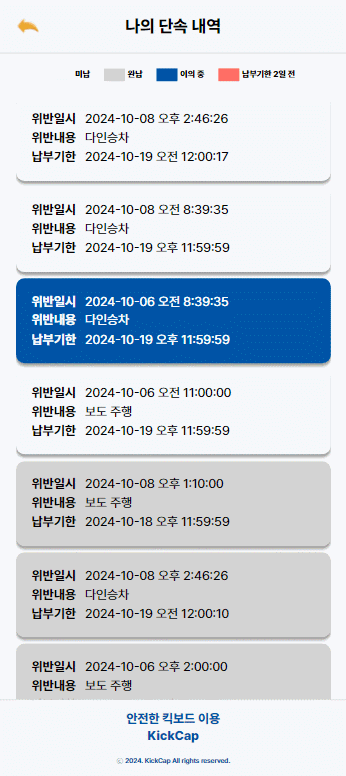
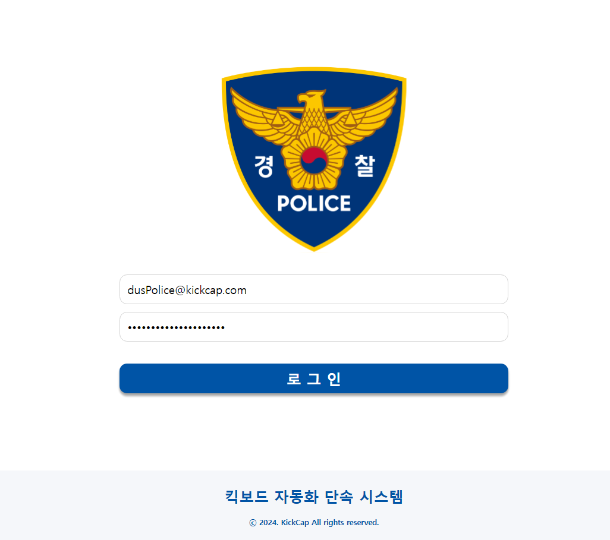

## 프로젝트 산출물

### 로그인 (시민)

- 사용자가 로그인 할 수 있습니다. 카카오, 네이버 소셜로그인을 이용하여 개인정보를 자동으로 인증할 수 있습니다.

### 단속 내역 확인 (시민)

- 사용자가 단속된 내역 목록을 확인할 수 있습니다. 단속 내역에 대한 범칙금 납부 처리, 이의 제기 및 잔여 납부 기한 상태에 따라 구분 표시됩니다.

### 고지서 조회 (시민)

- 단속 내역 목록에서 항목 선택 시, 해당 단속 내역의 상세 정보(고지서)를 조회할 수 있습니다.

### 단속 이의 제기 (시민)

- 단속 당한 내용을 확인하고 이에 대하여 이의 제기를 할 수 있습니다. 또한 경찰의 답변을 받을 수 있습니다.
- 이의 제기가 승인될 시 고지서는 자동 취소되고 반려 시 추가 이의 제기는 불가능 합니다.

### 범칙금 납부 (시민)

- 선택한 단속 항목에 대해 범칙금 납부 기능을 제공합니다. 이 때 사용자의 벌점이 10점 이상이라면 교통안전 교육 영상 시청 후 범칙금 납부가 가능합니다.

### 킥보드 불법 주차 신고 (시민)

- 불법 주차된 킥보드를 신고할 수 있습니다. 대상 킥보드의 사진을 찍고 킥보드 번호와 내용을 입력하면, 킥보드 위치 데이터를 기반으로 관할 경찰서로 신고가 접수됩니다.

### 실시간 제보 (시민)

- 킥보드 탑승 위반사항을 신고할 수 있습니다. 대상 킥보드의 사진을 찍고 킥보드 번호와 내용, 신고 위치 정보를 입력하고 위반 사항 체크 시 신고가 접수됩니다.

### 푸시 알림 기능 (시민)

- 신고 기능 이용 시, 신고 처리 결과(승인, 반려)에 따른 처리 푸시 알림을 받을 수 있습니다.
- 킥보드 이용 중 단속 건에 대해 고지서 발부, 범칙금 납부 기간 임박, 이의 제기한 건에 대해 담당 기관의 처리에 따른 푸시 알림을 받을 수 있습니다. 해당 항목들은 알림 목록 조회 페이지에서 해당 페이지로 바로 이동할 수 있습니다.

{: width="30%" height="30%"}

### 법률 챗봇 서비스 (시민)

- AI 챗봇을 통해 킥보드 또는 교통 법규 관련 정보를 제공받을 수 있습니다.

### 원클릭 신고 (시민)

- 킥보드 이용 중 사고 발생 시 관할 경찰서에 빠르게 신고할 수 있는 원클릭 신고 기능을 제공합니다. 신고 이용 시 이용자 정보와 신고자의 GPS 정보 데이터가 관할 기관에 전송됩니다.

### 경찰 로그인 (경찰)

- 경찰은 해당 경찰 아이디로 서비스에 접속할 수 있습니다. 각 경찰서에는 구분된 계정이 지급됩니다.

### 킥보드 대시보드 현황 확인 (경찰)

- 전국, 시도, 구군 별로 킥보드 1주일 통계 데이터, 시간대 별 데이터, 일일 및 전일대비 자료를 확인할 수 있습니다.
- 지도를 통해서는 단속 종류 및 시간대 별로 마커를 통해 주 단속구역을 확인할 수 있으며 CCTV 상세정보도 확인할 수 있습니다.

### 킥보드 사고 신고 접수 (경찰)

- 유저가 원클릭 신고 시 경찰쪽에서는 신고를 접수받고 출동합니다.

### 단속 리스트 확인(경찰)

- 단속 카메라로 자동 단속된 내역들을 단속 종류 별로 정보를 제공합니다.

### 국민 신고함 확인(경찰)

- 사용자가 제보한 사안들을 제보 종류 별로 정보를 제공합니다.
- 국민 신고함의 신고 정보를 경찰이 확인할 수 있고 처리 유무를 판단합니다. 추가로 불법 주차 같은 경우에는 주차장 정보를 제공합니다.

### 이의 제기 처리(경찰)

- 단속 내역에 이의 제기한 사안들을 처리 전 후로 나누어 정보를 제공합니다.
- 경찰은 해당 민원을 사유 답변과 고지서 취소로 처리할 수 있으며, 사유 답변은 이의가 받아 들여지지 않는 이유를 작성 해야 하고, 고지서 취소는 이의가 받아 들여진 경우 매크로 답변이 자동으로 발송됩니다.
- 특정 사용자의 이의제기를 조회할 수 있습니다.

